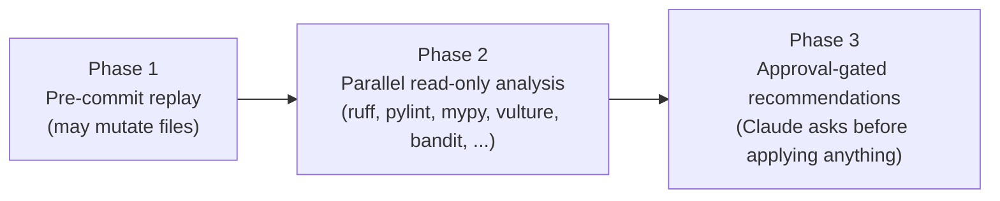

<h1 align="center">polylint</h1>

<p align="center">
  A three-phase lint runner for <a href="https://claude.com/claude-code">Claude Code</a>:
  replay a repository's own pre-commit hooks, fan out read-only analyzers in
  parallel, and report an honest per-tool status instead of a silent pass.
</p>

<p align="center">
  <a href="https://github.com/lucas-lima-s/claude-skill-polylint/actions/workflows/ci.yml"></a>
  
  
</p>

## Why

Most lint wrappers report a linter that crashed the same way they report a
linter that passed: silence, or a green checkmark. That is worse than not
linting at all, because it looks like coverage that isn't there. A broken
`ruff.toml`, a missing `pylint`, a `mypy` run that bails out mid-file on a
fatal type error - none of those are "clean", and none of them should render
as `ok`.

polylint classifies every tool's outcome into exactly one of six honest
statuses - `ok`, `found`, `config-broken`, `tool-missing`, `aborted`,
`skipped` - with a fixed precedence order and one invariant the test suite
enforces above everything else:

> A non-zero exit with output nothing recognizes can never be reported as `ok`.

It also replays a target repository's *own* `.pre-commit-config.yaml` before
running anything else, on the theory that a hook the team already checked
into the repo has already been authorized - no fresh confirmation needed to
run it again.

## What it does



| Phase | What runs | Permission |
|---|---|---|
| 1 - Pre-commit replay | The target repo's own `.pre-commit-config.yaml`, replayed against the target. Hooks may mutate files. | Always runs - already authorized by being committed. |
| 2 - Read-only analysis | Every enabled analyzer, launched in parallel: `ruff` (mandatory), `pylint`, `mypy`, `vulture`, `bandit`, plus opt-in `flake8`/`black`/`isort`/`pyright`/`semgrep`, and `eslint`/`prettier` for JS/TS targets. | Always runs - never mutates. |
| 3 - Approval-gated recommendations | A numbered list of leftover findings, presented for the caller to approve item-by-item. | Nothing is applied without an explicit answer. |

## Install

```bash
git clone https://github.com/lucas-lima-s/claude-skill-polylint "$HOME/.claude/skills/polylint"
```

Requires `bash`, a Python 3.11+ interpreter (for `scripts/classify.py`'s use
of `tomllib`), and whichever of `ruff`/`pylint`/`mypy`/`vulture`/`bandit`/etc.
you want the runner to invoke, on that interpreter. See
[SETUP.md](SETUP.md) for the full checklist and troubleshooting.

## Usage

```bash
bash polylint.sh <target> [flags]
```

Or, as a Claude Code skill, simply ask to lint something - `/polylint`,
"lint this", "check code style", "validate this file" all trigger it.

### Flags

| Flag | Default | Effect |
|---|---|---|
| `--config FILE` | auto-discovered | Use this `.polylint.toml` instead of walking up from the target. |
| `--profile NAME` | auto-matched | Force a specific `[[profiles]]` entry. |
| `--no-precommit` | on | Skip Phase 1 entirely. |
| `--no-mypy` / `--no-pylint` / `--no-vulture` / `--no-bandit` | all on | Skip that analyzer. `ruff` has no opt-out. |
| `--flake8` / `--black` / `--isort` / `--pyright` / `--semgrep` | all off | Opt in to that analyzer. |
| `--json` | off | Pipe the report through the classifier and print JSON. |
| `--version` | - | Print the version and exit. |

### Example

```bash
$ bash polylint.sh src/app.py --no-precommit
# polylint: src/app.py
profile: default
lang: py

===== ruff (exit=1) =====
src/app.py:3:8: F401 [*] `os` imported but unused
Found 1 error.

===== mypy (exit=0) =====
Success: no issues found in 1 source file
```

Pipe the same run through the classifier for a compact status table:

```bash
$ bash polylint.sh src/app.py --no-precommit | python scripts/classify.py
# polylint status report

| tool | status | exit | count |
|---|---|---|---|
| ruff | found | 1 | 1 |
| mypy | ok | 0 | 0 |
```

See [docs/example-report.md](docs/example-report.md) for a longer, real
captured run against the sample project (all five default Python analyzers),
and [docs/statuses.md](docs/statuses.md) for the full status taxonomy and
precedence rules.

## Configuration

### Environment variables

| Variable | Default | Purpose |
|---|---|---|
| `POLYLINT_PY` | first of `python3`, `python` on `PATH` | Interpreter used to run `scripts/classify.py` and, unless a profile overrides it, every `python -m <tool>` invocation. |
| `POLYLINT_CONFIG_DIR` | `${XDG_CONFIG_HOME:-$HOME/.config}/polylint` | Fallback config directory searched when no `.polylint.toml` is found walking up from the target. |
| `POLYLINT_JS_DIR` | unset | A standalone Node toolchain directory to fall back to for JS/TS targets when no `package.json` + ESLint config is found walking up from the target. |
| `POLYLINT_<TOOL>_CMD` (e.g. `POLYLINT_RUFF_CMD`, `POLYLINT_PYLINT_CMD`) | unset | Override the exact command used to invoke that tool, instead of `"$PY" -m <module>`. Useful for a wrapper script or a tool installed outside the resolved interpreter. |

### `.polylint.toml`

Discovered by walking up from the target; falls back to
`$POLYLINT_CONFIG_DIR/polylint.toml`, then to each tool's own built-in config
auto-discovery. All parsing happens in `scripts/classify.py --dump-config` -
the shell runner never parses TOML itself. See
[polylint.example.toml](polylint.example.toml) for a fully commented
reference, reproduced here:

```toml
[python]
interpreter = "python3"

[tools]
disabled = []

[configs]
ruff = "config/ruff.example.toml"
pylint = ""
mypy = ""
flake8 = ""

exclude = ["**/node_modules/**", "**/.venv/**", "**/vendor/**", "**/generated/**"]

[[profiles]]
name = "legacy"
match = ["**/legacy/**"]
interpreter = "python3"
tools = ["flake8"]
```

- `[python].interpreter` - default interpreter for Phase 2 tool invocations
  (overridden by `POLYLINT_PY` for bootstrapping the classifier itself, and
  by a matching profile's own `interpreter`).
- `[tools].disabled` - analyzers to disable globally, by name.
- `[configs].<tool>` - path to that tool's config file, resolved relative to
  the `.polylint.toml` that declared it. Only added to the tool's command
  line when non-empty; otherwise the tool falls back to its own config
  auto-discovery.
- `[configs].exclude` - glob patterns; a target matching any of them skips
  every phase entirely (still exits 0, with a one-line explanation).
- `[[profiles]]` - glob-matched routes. The first profile whose `match`
  globs hit the target (or the one named by `--profile`) can override the
  interpreter and/or replace the default enabled tool set - the `legacy`
  example above routes anything under `**/legacy/**` to a `flake8`-only
  pipeline with its own interpreter, without touching the rest of the
  project's configuration. An explicit CLI flag (`--no-pylint`, `--flake8`,
  etc.) always wins over whatever a profile would otherwise select.

## Development

```bash
uv sync --dev
uv run pytest -q
uv run ruff check .
uv run ruff format --check .
shellcheck -S warning polylint.sh
```

See [CONTRIBUTING.md](CONTRIBUTING.md) for the full workflow.

## License

[MIT](LICENSE)
